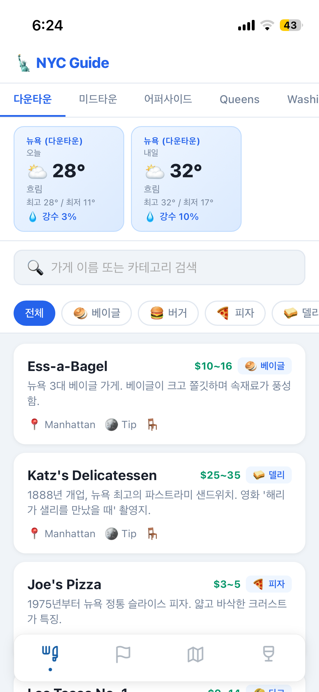

# NYC Guide

뉴욕·퀸즈·워싱턴 D.C.·나이아가라를 여행하는 한국인을 위한 **오프라인 우선 웹앱**.

현지 맛집에서 당황하지 않고 주문할 수 있도록 돕는 한영 병기 주문 가이드 + 관광 스팟 + 화장실 찾기.

> **라이브**: https://tnfhrnsss.github.io/nyc/us-order-guide/



---

## 주요 기능

| 기능 | 설명 |
|------|------|
| 맛집 주문 가이드 | 가게별 예상 질문 순서, 추천 답변, 소스 설명 한국어 제공 |
| 관광 스팟 | 무료/유료, 예약 여부, 팁, Google Maps 연결 |
| 날씨 | 지역별 오늘·내일 날씨 (Open-Meteo, 미국 동부 타임존) |
| 지도 | Leaflet + OpenStreetMap, 카테고리별 핀 |
| 화장실 찾기 | 현재 위치 기반 주변 화장실 Leaflet 지도 표시 |
| 오프라인 | Service Worker로 앱 전체 캐시 |
| PWA | 홈 화면에 설치 가능 |

---

## 지역 커버리지

### 맛집 (45곳)

**Manhattan — 다운타운 (14곳)**
- Ess-a-Bagel (베이글) `$10~16`
- Katz's Delicatessen (델리) `$25~35`
- Joe's Pizza (피자) `$3~5`
- Los Tacos No. 1 (타코) `$9~14`
- Tacombi (타코) `$25~35`
- Ippudo NY (라멘) `$20~28`
- Dominique Ansel Bakery (베이커리) `$6~14`
- Clinton St. Baking Co. (베이커리) `$15~22`
- Russ & Daughters Cafe (델리) `$18~28`
- Sadelle's (베이커리) `$18~30`
- Breads Bakery (베이커리) `$5~9`
- Blue Bottle Coffee (커피) `$5~8`
- Intelligentsia Coffee (커피) `$5~8`
- La Colombe Coffee (커피) `$5~8`

**Manhattan — 미드타운 (11곳)**
- Stumptown Coffee Roasters (커피) `$7~9`
- The Halal Guys (기타) `$8~12`
- Totto Ramen (라멘) `$18~25`
- Go Go Curry (기타) `$12~16`
- Shake Shack (버거) `$10~15`
- Burger Joint (버거) `$13~17`
- Magnolia Bakery (베이커리) `$4~7`
- Junior's Restaurant (기타) `$10~20`
- Jongro BBQ (기타) `$25~40`
- Dallas BBQ Times Square (기타) `$15~30`
- CAVA (기타) `$12~16`

**Manhattan — 어퍼사이드 (6곳)**
- Levain Bakery (베이커리) `$4~6`
- Absolute Bagels (베이글) `$3~8`
- Gray's Papaya (기타) `$3~6`
- Cafe Lalo (커피) `$8~14`
- Hungarian Pastry Shop (베이커리) `$3~6`
- Zabar's (델리) `$5~12`

**Queens — 플러싱·Astoria (5곳)**
- Xi'an Famous Foods (기타) `$12~18`
- Joe's Shanghai (기타) `$20~30`
- Nan Xiang Xiao Long Bao (기타) `$8~12`
- Taverna Kyclades (기타) `$50~80`
- New World Mall Food Court (기타) `$8~15`

**Washington D.C. (9곳)**
- Old Ebbitt Grill (기타) `$18~30`
- Founding Farmers (기타) `$15~25`
- District Taco (타코) `$8~13`
- Shake Shack DC (버거) `$10~16`
- Mitsitam Native Foods Café (기타) `$10~16`
- Jaleo by José Andrés (기타) `$15~28`
- Eastern Market (기타) `$5~15`
- Ted's Bulletin (델리) `$12~20`
- Ben's Chili Bowl (델리) `$8~14`

### 관광 스팟 (27곳)

**Manhattan — 다운타운 (8곳)**: 브루클린 브리지, 자유의 여신상, 휘트니 미술관, 하이라인, 첼시 마켓, 트레이더 조, 소호, 9/11 메모리얼

**Manhattan — 미드타운 (10곳)**: 베슬, 엣지 전망대, 타임스 스퀘어, 엠파이어 스테이트, 탑 오브 더 록, 그랜드 센트럴, 뉴욕 공립도서관, MoMA, H Mart 코리아타운, 홀푸드 마켓

**Manhattan — 어퍼사이드 (3곳)**: 센트럴 파크, The Met, 자연사 박물관

**Queens (2곳)**: 플러싱 메도스 코로나 파크, H Mart 플러싱

**Washington D.C. (4곳)**: 링컨 기념관, 워싱턴 기념탑, 스미소니언 자연사 박물관, 국회의사당

---

## 로컬 실행

```bash
cd us-order-guide
python3 -m http.server 8787
```

브라우저에서 `http://localhost:8787` 접속.

> 빌드 도구 불필요. 순수 HTML + CSS + Vanilla JS.

---

## 기술 스택

```
Frontend   HTML5 + Vanilla JS (빌드 없음)
스타일     CSS (모바일 우선, 단일 파일)
지도       Leaflet.js + OpenStreetMap
날씨       Open-Meteo API (무료, API 키 불필요)
데이터     stores.json / spots.json (로컬)
오프라인   Service Worker (PWA, 캐시 v3)
배포       GitHub Pages
```

---

## 파일 구조

```
us-order-guide/
├── index.html       푸드 홈 (맛집 목록)
├── store.html       가게 상세 (주문 흐름 · 소스 · 팁)
├── spots.html       관광 스팟
├── map.html         지도
├── restroom.html    화장실 찾기 (현재 위치 기반)
├── manifest.json    PWA 설정
├── sw.js            Service Worker (nyc-guide-v3)
├── css/style.css
├── js/
│   ├── app.js       맛집 홈 로직
│   ├── store.js     가게 상세 로직
│   ├── spots.js     스팟 로직
│   ├── map.js       지도 로직
│   ├── restroom.js  화장실 찾기 로직
│   └── weather.js   날씨 API (America/New_York 타임존)
└── data/
    ├── stores.json  맛집 데이터 (45곳)
    └── spots.json   스팟 데이터 (27곳)
```

---

## 데이터 추가 방법

### 맛집 추가 (`data/stores.json`)

`"stores"` 배열에 항목 추가:

```json
{
  "id": "가게-이름-kebab",
  "name": "영문 가게명",
  "category": "bagel|pizza|deli|coffee|taco|ramen|burger|bakery|other",
  "region": "manhattan|queens|washington|niagara",
  "area": "downtown|midtown|uptown",
  "address": "주소",
  "lat": 0.0, "lng": 0.0,
  "tip_expected": true,
  "has_seating": true,
  "price_range": "$X~Y",
  "description": "한국어 설명",
  "ordering_flow": [...],
  "sauce_guide": [...],
  "tips": [...]
}
```

### 관광 스팟 추가 (`data/spots.json`)

루트 배열에 항목 추가:

```json
{
  "id": "스팟-이름-kebab",
  "name_ko": "한국어 스팟명",
  "region": "manhattan|queens|washington",
  "area": "downtown|midtown|uptown|null",
  "category": "landmark|museum|park|view|market",
  "address": "주소",
  "lat": 0.0, "lng": 0.0,
  "admission": "free|paid",
  "admission_note": "무료 or 유료 ($30)",
  "reservation": false,
  "hours": "운영시간",
  "description_ko": "한국어 설명",
  "tips": [...]
}
```

> JSON 추가 후 코드 수정 없이 자동 반영됨.

---

## GitHub Pages 배포

저장소: https://github.com/tnfhrnsss/nyc

배포 URL: https://tnfhrnsss.github.io/nyc/us-order-guide/

GitHub 저장소 Settings → Pages → Source: `main` 브랜치, `/ (root)` 선택.

---

## 향후 계획

- [ ] 지도에 스팟 핀 통합 (맛집 + 관광지 통합 뷰)
- [ ] PWA 아이콘 개선
- [ ] 팁 계산기 (18/20/22%)
